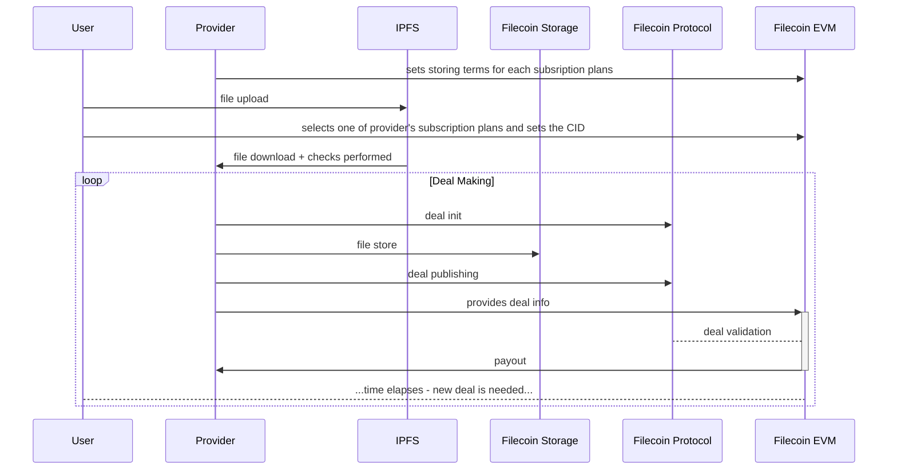
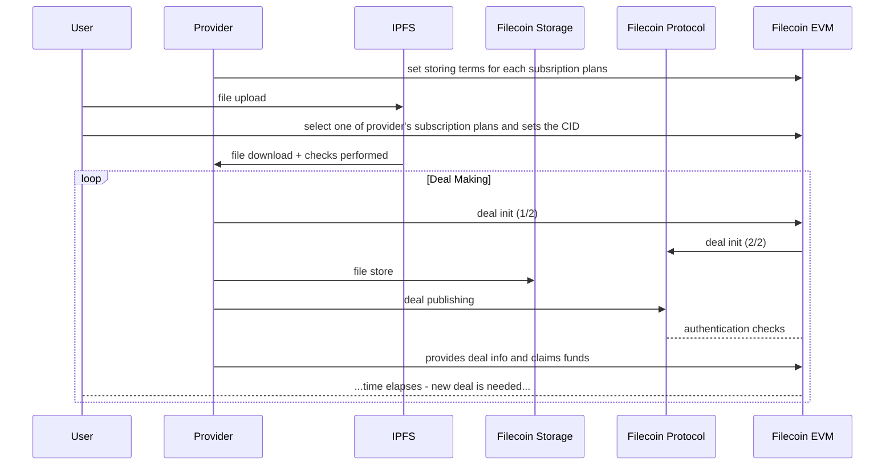
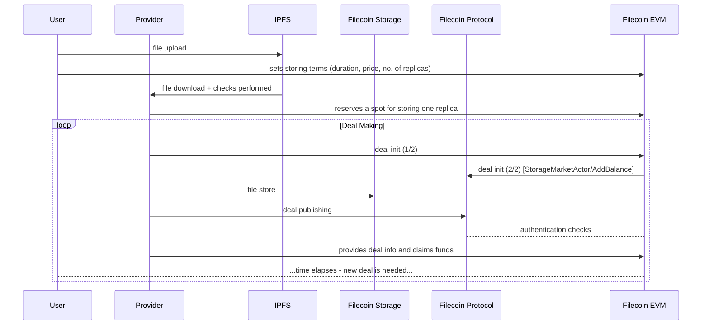

### Version 0.1.0

```mermaid
sequenceDiagram
    participant User
    participant Provider
    participant IPFS
    participant Filecoin Storage
    participant Filecoin Protocol
    participant Filecoin EVM


    Provider->>Filecoin EVM: sets storing terms for each subsription plans
    User->>IPFS: file upload
    User->>Filecoin EVM: selects one of provider's subscription plans and sets the CID
    IPFS->>Provider: file download + checks performed
    loop Deal Making
        Provider->>Filecoin Protocol: deal init
        Provider->>Filecoin Storage: file store
        Provider->>Filecoin Protocol: deal publishing
        Provider->>+Filecoin EVM: provides deal info
        Filecoin EVM-->Filecoin Protocol: deal validation
        Filecoin EVM->>-Provider: payout

        User --> Filecoin EVM: ...time elapses - new deal is needed...
    end
```

### Version 0.1.1

```mermaid
sequenceDiagram
    participant User
    participant Provider
    participant IPFS
    participant Filecoin Storage
    participant Filecoin Protocol
    participant Filecoin EVM

    Provider->>Filecoin EVM: set storing terms for each subsription plans
    User->>IPFS: file upload
    User->>Filecoin EVM: select one of provider's subscription plans and sets the CID
    IPFS->>Provider: file download + checks performed
    loop Deal Making
        Provider->>Filecoin EVM: deal init (1/2)
        Filecoin EVM->>Filecoin Protocol: deal init (2/2)
        Provider->>Filecoin Storage: file store
        Provider->>Filecoin Protocol: deal publishing
        Filecoin Protocol-->Filecoin EVM: authentication checks
        Provider->>Filecoin EVM: provides deal info and claims funds

        User-->Filecoin EVM: ...time elapses - new deal is needed...
    end
```

### Version 0.1.2

```mermaid
sequenceDiagram
    participant User
    participant Provider
    participant IPFS
    participant Filecoin Storage
    participant Filecoin Protocol
    participant Filecoin EVM


    User->>IPFS: file upload
    User->>Filecoin EVM: sets storing terms (duration, price, no. of replicas)
    IPFS->>Provider: file download + checks performed
    Provider->>Filecoin EVM: reserves a spot for storing one replica

    loop Deal Making
        Provider->>Filecoin EVM: deal init (1/2)
        Filecoin EVM->>Filecoin Protocol: deal init (2/2) [StorageMarketActor/AddBalance]
        Provider->>Filecoin Storage: file store
        Provider->>Filecoin Protocol: deal publishing
        Filecoin Protocol-->Filecoin EVM: authentication checks
        Provider->>Filecoin EVM: provides deal info and claims funds

        User-->Filecoin EVM: ...time elapses - new deal is needed...
    end
```
